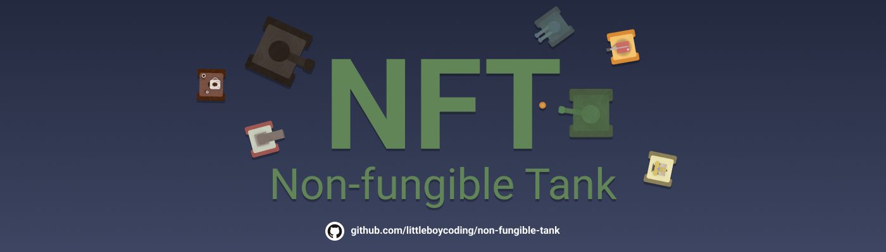
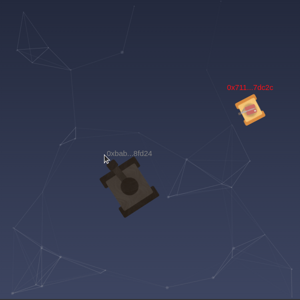

# Non-fungible Tank



Non-fungible-tank or NFT is NFT-based real-time multiplayer tank game where you play as tank to destroy other.

The tank itself is an asset which is unique and truly own by player, allow player to transfer, trade or sell it, it possible by leverage power of blockchain.

[Browse on OpenSea (Testnet)](https://testnets.opensea.io/collection/non-fungible-tank)

## Table of contents

- [Gameplay](#gameplay)
- [Setup](#setup)
- [Silly note](#silly-note)

## Gameplay

Casual two tanks fighting 🚀


Gigantic clashing tank 💥



## Setup

This project use docker & compose, make it easy to deploy and run.

```sh
$ git clone https://github.com/littleboycoding/non-fungible-tank.git
$ cd non-fungible-tank
$ docker compose up
```

Now open up http://localhost:5000 in your web browser.

## Silly note

- **Security problem** - This is my smart contract educational project, thus I don't consider my game is secured (gameplay perspective) because that is not my main goal here except for smart contract part which I try to avoid any possible attack. if you have any tips to help me secure my project I'll be graceful !

- **Spaghetti code** - The project was meant to be finished quickly as possible and then my project become mess the code is hard to maintain, I kept reinventing the wheel. Looks like I need some spaghetti 🍝
